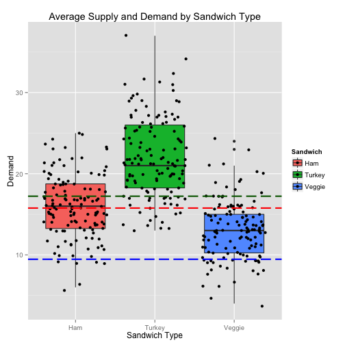
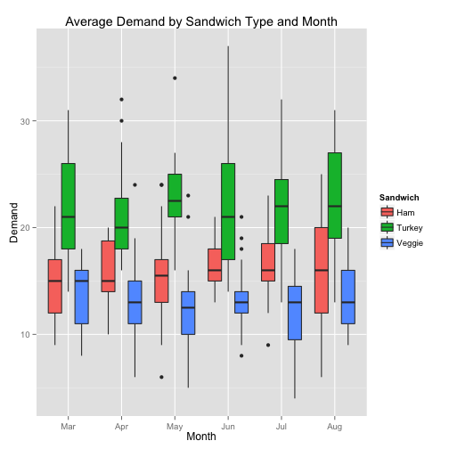
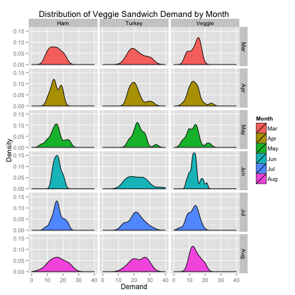

* * *

##Table of Contents
* [Background](#background)
* [Overview of Datasets](#dataset_overview)
* [Supply vs Demand](#supply_demand)
* [Seasonal Variation](#seasonal_variation)
* [Increasing James' Profit](#improving_profit)
* [Current and Expected Profit](#expected_profit)
* [Conclusion](#conclusion)

* * *


```
## Error in library("pastecs"): there is no package called 'pastecs'
```

```
## Error in library("reshape"): there is no package called 'reshape'
```

```
## Error in library("Hmisc"): there is no package called 'Hmisc'
```

```
## Error in is.factor(x): could not find function "capitalize"
```


##<a name="background"></a>Background

James has been operating a sandwich stand in the lobby of his office building during the lunch hour for the past two years.He has been tracking sandwich demand over the two years and he has carefully recorded the number of each type of sandwich demanded, the number he brought with him to sell, and his prices for each type of sandwich.

James provided his data set for analysis.

* * *

##<a name="dataset_overview"></a>Overview of Datasets

###sales.csv
The file `sales.csv` contains the demand and availability by date for each of the three sandwiches that James sells.


```r
summary(historical_data[,c("date_dt")])
```

```
##                  Min.               1st Qu.                Median 
## "2014-03-03 00:00:00" "2014-04-16 06:00:00" "2014-05-31 12:00:00" 
##                  Mean               3rd Qu.                  Max. 
## "2014-05-31 12:02:18" "2014-07-15 18:00:00" "2014-08-29 00:00:00"
```

```r
stat.desc(historical_data[,c("demand.ham","demand.turkey","demand.veggie","available.ham","available.turkey","available.veggie")])
```

```
## Error in eval(expr, envir, enclos): could not find function "stat.desc"
```

As we can see from the data above, the data ranges from 2014/03/03 to 2014/08/29(n=130). In addition, the mean demand for each sandwich type ranges from 22.05 (Ham) to 13.06 (Veggie). The best selling sandwich is Ham

###details.csv
The file contains cost and sale pricing by sandwich type as follows:

```r
(pricing)
```

```
##     type price cost
## 1    ham   6.5  3.5
## 2 turkey   6.5  4.0
## 3 veggie   5.0  2.5
```

* * *

##<a name="supply_demand"></a>Supply vs Demand

From the plot below we can see that the production levels for Turkey and Veggie sandwiches are below the demand.

 


```
## Error in eval(expr, envir, enclos): could not find function "rename"
```

```
## Error in eval(expr, envir, enclos): could not find function "rename"
```

```
## Error in match.names(clabs, names(xi)): names do not match previous names
```

```
## Error in ggplot(totals, color = c("red", "darkgreen", "blue"), aes(factor(sandwich), : object 'totals' not found
```

* * *

##<a name="seasonal_variation"></a>Seasonal Variation of Demand

Before we proceed any further, we want to know if there are any seasonal statistically significant variations. We want to prove the significance of any of the following variations by sandwich type:

* From day of the week to day of the week (inter-day - sandwich:day_of_week)
* From month to month (inter-month - sandwich:month)
* From month and day of the week to month and day of the week (inter-month-day - sandwich:month:day_of_week).

We conducted an analysis of variance of the demand in order to accept or reject each of our hypothesis. 

The results are as follows:


```r
summary(aov(demand ~ sandwich:month+sandwich:day_of_week+sandwich:month:day_of_week
            ,data=historical_pivoted
            )
        )
```

```
##                             Df Sum Sq Mean Sq F value Pr(>F)    
## sandwich:month              17   5648   332.2  18.743 <2e-16 ***
## sandwich:day_of_week        12    226    18.8   1.063  0.391    
## sandwich:month:day_of_week  60   1034    17.2   0.972  0.538    
## Residuals                  300   5318    17.7                   
## ---
## Signif. codes:  0 '***' 0.001 '**' 0.01 '*' 0.05 '.' 0.1 ' ' 1
```

As we can see in the results above, the only statistically significant variation in the distribution of the demand is due to the sandwich type and month.

The chart below illustrate the actual fluctuations of the demand by sandwich type and month:

  

**Based on these findings, we will use monthly volumne by sandwich type to make our recommendations.**


* * *

##<a name="improving_profit"></a>Increasing James' Profit

The data presents some good opportunities for James to increase his profit by adjusting his supply.

James often produces less sandwiches than the actual demand, particularly turkey and veggie sandwiches. 

In addition, we established that there exists variation in the demand from month to month. Adjusting his supply levels accordingly will help him maximize his profit.

We recommend that James adjusts his production levels according to the following table:


```
## Error in eval(expr, envir, enclos): could not find function "rename"
```

```
## Error in ceiling(expected_demand$expected_demand): non-numeric argument to mathematical function
```

```
## Error in data.frame(cast(expected_demand, month ~ sandwich, first, value = "expected_demand")): could not find function "cast"
```

```
## Error in eval(expr, envir, enclos): object 'expected_demand_output_table' not found
```

##<a name="expected_profit"></a>Current and Expected Profit

The table below presents James' current and expected profits based on the recomended production levels.


```
## Error in aggregate.data.frame(lhs, mf[-1L], FUN = FUN, ...): no rows to aggregate
```

```
## Error in rbind(profit_summary, profit_grand_total): object 'profit_summary' not found
```

```
## Error in with(profit_summary, sprintf("%3.1f%%", 100 * (profit_expected - : object 'profit_summary' not found
```

```
## Error in eval(expr, envir, enclos): object 'profit_summary' not found
```

The expected profit was calculated by applying the recomended production levels to the provided historical data. As we can see, James' profit would have increased by **8.4%**.

* * *

##<a name="conclusion"></a>Conclusion

need help!!!!!!what should i type?
